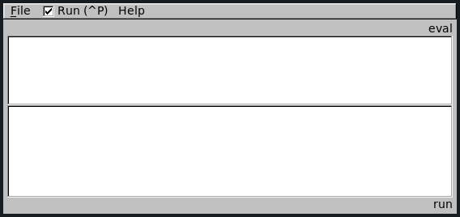

Before getting into all the details of the `alv` language, let's quickly run an
example program to make sure that everything is working correctly:

    ([1]import* time)
    ([2]print ([3]every 0.5 "hello world!"))

Open a text file save this piece of code as `hello.alv`. You can also find this
example program in the repository and the windows binary package.

As mentioned earlier, there are two different ways to run `alv` programs: using
the copilot GUI, or in the terminal.

## starting the copilot GUI
On Linux and Mac OS X, you can launch the GUI by executing the `alv-fltk`
command. On Windows, you can double-click `alv-fltk.bat`. This window should
open:

Now open `hello.alv` using `File > Open Script` or the shortcut `^O`
(control-O). The copilot should start printing `hello world` over and over
again in the lower field.

You can pause and resume execution using the `Run` button or the `^P` shortcut.
To stop the program simply close the window.

## starting the copilot in the terminal
To run a file in the terminal, invoke the command `alv <path/to/hello.alv>`. If
your system cannot find the `alv` command, check your installation and `PATH`.
On Windows, it is also possible to drag your `alv` file onto `alv.bat`.

You should now see the text `hello world` being printed over and over again,
twice a second. You can stop the copilot by pressing `^C` (control-C).
